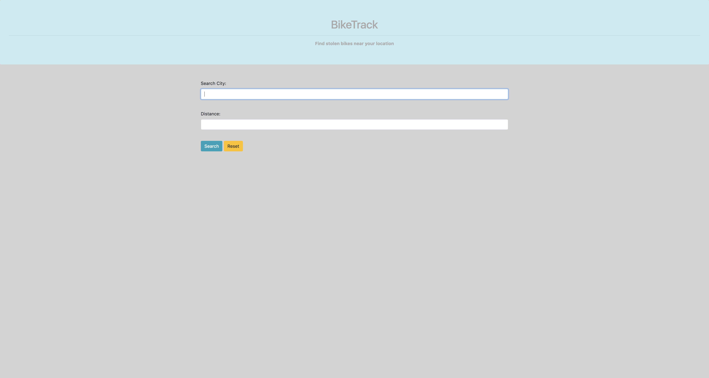
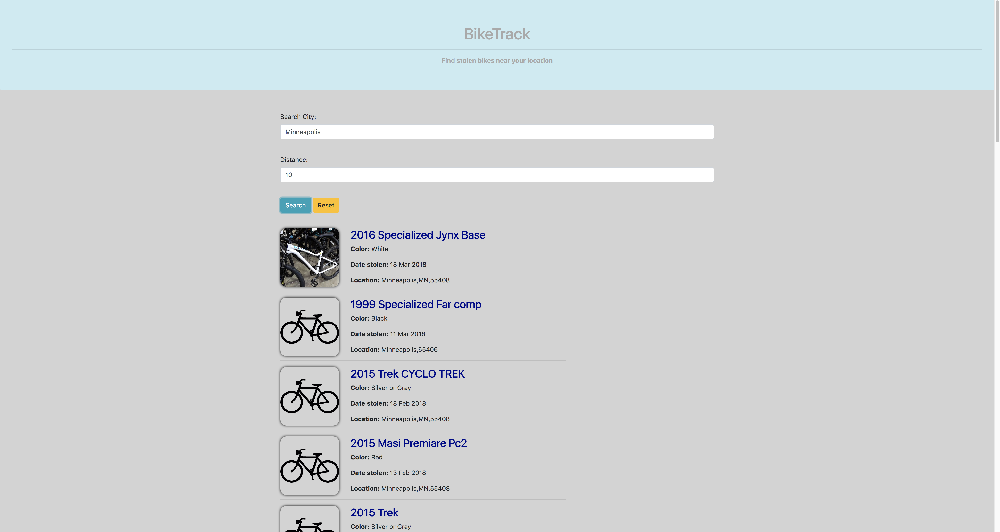

# BikeTrack

#### Epicodus Spring 2018

#### By **Nanette Girzi**

## Description

First application using an API. User can search for stolen bikes near a location.

_ The home page of the application.

_ Enter City and distance radius - Seattle List

_ Minneaplis LIst

## Setup/Installation Requirements

* $ clone this repo
* $ Go to www.bikeindex.org and login/create an account
* $ Get an API key
* $ Create a .env file in the root folder with API_KEY=[Your API_Key goes here]
* $ cd to BikeTrack
* $ npm install
* $ npm run start

## Specifications

#### Location input by User
#### Distance from location input from user
#### Return list of bikes including, make, color, date stolen and location

## Known Bugs

No known bugs at this time.

## Support and contact details

If you have suggestions please email ngirzi@gmail.com

## Technologies Used

* JavaScript
* CSS
* HTML
* Bootstrap
* Node
* Webpack

### License

*This software is licensed under the MIT license.*

Copyright (c) 2018 **Nanette Girzi**
